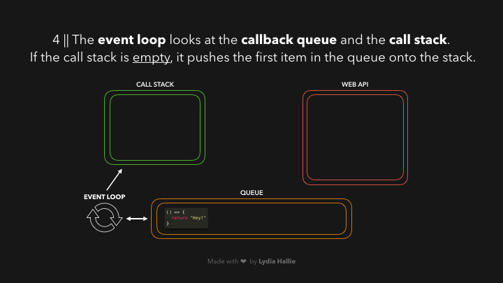

# ✨♻️ JavaScript Visualized: Event Loop

Oh boi the event loop. It’s one of those things that every JavaScript developer has to deal with in one way or another, but it can be a bit confusing to understand at first. I’m a visual learner so I thought I’d try to help you by explaining it in a visual way through low-res gifs because it's 2021 and gifs are somehow still pixelated and blurry.

But first, what is the event loop and why should you care?

JavaScript is **single-threaded**: only one task can run at a time. Usually that’s no big deal, but now imagine you’re running a task which takes 30 seconds.. Ya.. During that task we’re waiting for 30 seconds before anything else can happen (JavaScript runs on the browser’s main thread by default, so the entire UI is stuck) 😬 It’s 2021, no one wants a slow, unresponsive website.

Luckily, the browser gives us some features that the JavaScript engine itself doesn’t provide: a Web API. This includes the DOM API, setTimeout, HTTP requests, and so on. This can help us create some async, non-blocking behavior 🚀

When we invoke a function, it gets added to something called the call stack. The call stack is part of the JS engine, this isn’t browser specific. It’s a stack, meaning that it’s first in, last out (think of a pile of pancakes). When a function returns a value, it gets popped off the stack 👋


The ```respond``` function returns a ```setTimeout``` function. The ```setTimeout``` is provided to us by the Web API: it lets us delay tasks without blocking the main thread. The callback function that we passed to the ```setTimeout``` function, the arrow function ```() => { return 'Hey' }``` gets added to the Web API. In the meantime, the ```setTimeout``` function and the respond function get popped off the stack, they both returned their values!


In the Web API, a timer runs for as long as the second argument we passed to it, 1000ms. The callback doesn’t immediately get added to the call stack, instead it’s passed to something called the queue.


This can be a confusing part: it doesn't mean that the callback function gets added to the callstack(thus returns a value) after 1000ms! It simply gets added to the queue after 1000ms. But it’s a queue, the function has got to wait for its turn!

Now this is the part we’ve all been waiting for… Time for the event loop to do its only task: **connecting the queue with the call stack!** If the call stack is **empty**, so if all previously invoked functions have returned their values and have been popped off the stack, the first item in the queue gets added to the call stack. In this case, no other functions were invoked, meaning that the call stack was empty by the time the callback function was the first item in the queue.



The callback is added to the call stack, gets invoked, and returns a value, and gets popped off the stack.


Reading an article is fun, but you'll only get entirely comfortable with this by actually working with it over and over. Try to figure out what gets logged to the console if we run the following:

```javascript
const foo = () => console.log('First');
const bar = () => setTimeout(() => console.log('Second'), 1000);
const baz = () => console.log('Third');

bar();
foo();
baz();
```

Okay, Let's quickly take a look at what's happening when we're running this code in a browser:


  1. We invoke `bar`. bar returns a `setTimeout` function.
  2. The callback we passed to `setTimeout` gets added to the Web API, the `setTimeout` function and bar get popped off the `callstack`.
  3. The **timer** runs, in the meantime `foo` gets invoked and logs First. foo returns `(undefined)`,`baz` gets invoked, and the callback gets added to the **`queue`**.
  4. `baz` logs `Third`. The event loop sees the callstack is empty after `baz` returned, after which the callback gets added to the call stack.
  5. The callback logs `Second`.
