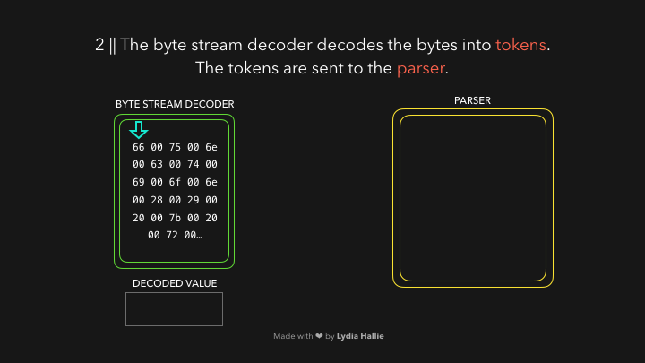

# 🚀⚙️ JavaScript Visualized: the JavaScript Engine

JavaScript is the most loved and the most hated language in the world.
but how can a machine actually understand the code you've written? As JavaScript devs, we usually don't have to deal with compilers ourselves? because we don't write assembly or low level C code.
However, it's definitely good to know the basics of the JavaScript engine and see how it handles our human-friendly JS code, and turns it into something machines understand! 🥳

* **NOTE** This explanation is mainly based on the V8 engine used by nodejs and Chromium-based browsers.

---

The HTML parser encounters a `script` tag with a source. Code from this source get loaded from either the `Network`, `cache`, or an installed `service worker`. The response is the requested script as a `STREAM OF BYTES` which the byte stream decoder takes care of! The `**Byte Stream decoder**` decodes the stream of bytes as it's being downloaded.


The byte stream decoder creates `*tokens*` from the decoder stream of bytes. For example, `0066` decodes to `f`, `0075` decodes to `u`, `006e` to `n`, `0063` to `c`, `0074` to `t`, `0069` to `i`, `006f` to `o`, and `006e` to `n` followed by a whitespace. Seems like you wrote `function`! this is a reserved keyword in JS, a token gets created, and sent to the parser (and pre-parser, which I didn't cover in teh gifs But I think I will explain it later).
The same happens for the rest of teh byte stream.



---

The engine uses two parsers: the *pre-parser*, and the *parser*.  In order to reduce the time it takes to load up a website, the engine tries to avoid parsing code that's not necessary right away. The preparser handles code that may be used later on, while the parser handles the code that’s needed immediately! If a certain function will only get invoked after a user clicks a button, it's not necessary that this code is compiled immediately just to load up a website. If the user eventually ends up clicking the button and requiring that piece of code, it gets sent to the parser.

The parser creates nodes based on the tokens it recives from the byte stream decoder. With thses nodes, it creates an Abstract Syntax Tree, or AST (If u wanna build a compiler or a shell u have to implement this AST 🌴).


---

Next, it's time for the *interpreter*! The interpreter which walks through the AST, and generates *Byte Code* based on the information that the AST contains. Once the byte code has been generated fully, thet AST got deleted, Clearing up memory space. Finally, we have something that a machine can work with! 🎉✅


---

Although byte code is fast, it can be faster. As this bytecode runs, information is being generated. It can detect whether certain behavior happens often, and the butes of the data that's been used. Maybe you've been invoking a function dozens of times: It's time to optimize this so it will run even faster! ⚡️🏃‍♂️

The byte code, together with the generated type feedback, is sent to an *Optimizing Compiler*. The optimizing compiler takes the byte code and type feedback, and generates highly optimized machine code from these 🚀.


---

JS is a dynamically typed language, meaning that they types of data can change constantly. It would be extremely slow if the JavaScript engine had to check each time which datatype a certain value has.

In order to reduce the time it takes to interpret the code, optimized machine code only handles the cases the engine has seen before while running the bytecode. If we repatedly used a certain piece of code that returned the same data tyoe over and over, the optimized machine code can simply be re-used in order to speed things up. However since JavaScript is dynamically typed, it can happen that the same piece of code suddenly returns a different type of data. If that happens, the machine code gets de-optimized, and the falls back to interpreting the generated byte code.

Say a certain function is invoked a 100 times and has always returned the same value so far. It will assume that it will also return this value the 101st time you invoke it.

Let's say that we have the following sum, that's (so far) always been called with numerical values as arguments each time:

```javascript
  function sum(a, b) {
    return a + b;
  }

  sum(1, 3)
```

This returns the number `4`! The next time we invoke it, it will assume we're invoking it again with two numerical values.

If that's true, no dynamic lookup is required, and it can just re-use the optimized machine code. Else, if the assumption was incorrect, it will revert back to the original bute code instead of the optimized machine code.

For example, the next time we invoke it, we pass a string instead of a number. Since JavaScript is dynamically typed, we can do this without any errors!

```javascript
  function Sum(a, b) {
    return a + b;
  }

  Sum('1', 3);
```

This means the number `3` will get converted into a string, and the function will return the string `'13'` instead. It goes back to executing the interpreted bytecode and updates the type feedback.

---

I hope this explanation was usefil to you 😁! of course there are many parts to the engine that I haven't covered in this post (JS heap, call stack, etc) which I might cover later if I have time ofc! Definetly encourage you to start doing some research yourself if you're interested in the internals of JS, V8 is open source and has some great documentation on how it works under the hood So it might be useful to just take a close look at it ❤️.