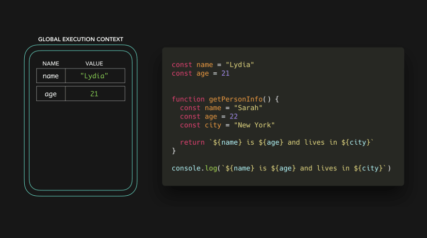

# ⚡️⛓JavaScript Visualized: Scope (Chain)

Time for the scope chain 🕺🏼 In this post I assume you know the basics of execution contexts: I’ll soon write a post on that too though 😃.

let's take a quick look at the following code:

```javascript
  const name = 'cRYP70N';
  const age = 21;
  const city = 'Marrakech';

  function getPersonInfo() {
    const name = 'Otmane';
    const age = 20;

    return `${name} is ${age} and lives in ${city}`
  }

  console.log(getPersonInfo());
```

We're invoking the `getPersonInfo()` function, Which returns a string containing the values of the `name`, `age` and `city` variables.

`Otmane is 22 and live in Marrakech`. But the `getPersonInfo` function doesn't contain a variable named `city` 🧐 ? How did it know the value of `city`?

First memory space is set up for the different contexts. We have the default **Global Context** (`window` in a browser, `global` in Node), and a **Local context** for the `getPersonInfo` function which has been invoked. Each context also has a **_scope chain_**.

For the `getPersonInfo` function, the scope chain looks something like this (don't worry, its fine if it doesn't make sense now):


The scope chai is basically a "_Chain Of References_" to objects that contain references to values (and some other scopes) that are referencable in that execution context. (⛓: "Hey, Those are all the values you can reference from within this context".) The scope chain gets created when the execution context is created, meaning it's created at runtime!

However, I think I won't talk about the __Activation object__ RN or the execution context in general, let's just focus now on scope! In the following examples, the key/value pairs in teh execution contexts represent the references that the scope chain has to the variables.


The scope chain of the global execution context has a reference to 3 variables: `name` with the value `Lydia`, `age` with the value `21`, and `city` with the value `San Francisco`. In the local context, we have a reference to 2 variables: `name` with the value `Sarah`, and `age` with the value `22`.

When we try to access the variables in the `getPersonInfo` function, the engine first checks the local scope chain.

When we try to access `getPersonsInfo`'s varibales, the engine first checks the local scope chain then the _parent_ scope then the _global_ scope and if he didn't find it we got the error `Not defined`


The local scope chain has a reference to `name` and `age`! `name` has the value of `Sarah` and `age` has the value of `22`. But now, what happens when it tries to access `city`?

In order to find the value for `City` the engine "Goes down the scope chain".
This basically just means that the engine doesn't give up That ez 😂: it works hard for us to see if it can find a value for the variable `city` in the **outer** scope that the local scope had a reference to, the **_GLOBAL OBJECT_** in this case.


In the global context, we declared the variable city with the value of San Francisco, thus has a reference to the variable city. Now that we have a value for the variable, the function getPersonInfo can return the string Sarah is 22 and lives in San Francisco 🎉

---

We can go down the scope chain, but we can't go up the scope chain. (Okay this may be confusing because some people say up instead of down, so I'll just rephrase: You can go to outer scopes, but not to more inner... (innerer..?) scopes. I like to visualize this as a sort of waterfall:


Why not even deeper:


---

Let's take this code as an example.



It's almost the same, however there's one big difference: we _only_ declared `city` in the `getPersonInfo` function now, and not in the **global scope**. We didn't invoke the `getPersonInfo` function, so no local context is created either. Yet, we try to access the values of `name`, `age` and `city` in the global context.


It throws a `ReferenceError`! It couldn't find a reference to a variable called `city` in the **global scope**, and there were no **outer scopes** to look for, and it **_cannot_** go up the scope chain.

This way, you can use scope as a way to "protect" your variables and re-use variable names.

---

Besides global and local scopes, there is also a **block scope**. Variables declared with the _`let` or `const` keyword are scoped to the nearest curly brackets (`{}`).

```javascript
const age = 21

function checkAge() {
  if (age < 21) {
    const message = "You cannot drink!"
    return message
  } else {
    const message = "You can drink!"
    return message
  }
} 
```

We can visualize the scopes as:


We have a global scope, a function scope, and two block scopes. We were able to declare the variable message twice, since the variables were scoped to the curly brackets

---

Quick recap 🚀:

* You can see "scope chain" as a chain of references to values that we can access in the current context.
* Scopes also make it possible to re-use variable names that were defined further down the scope chain, since it can only go down the scope chain, not up.

That was it for scope (chains)! There's tons more to say about this so I may add extra info when I have some free time.

_*NOTE: some of those pictures are picked from dev.to
for more info checkout dev.to/lydiahallie*_